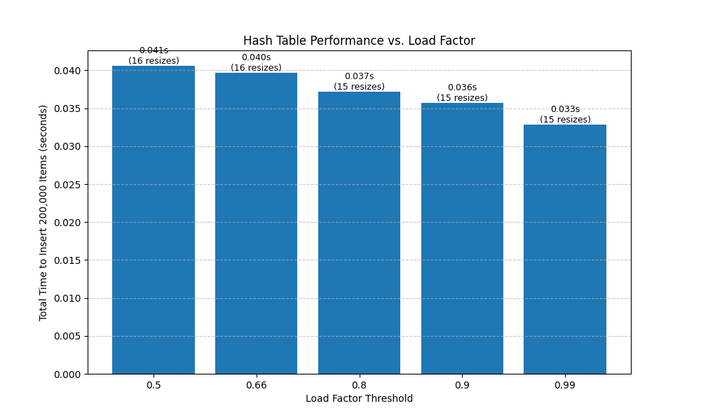
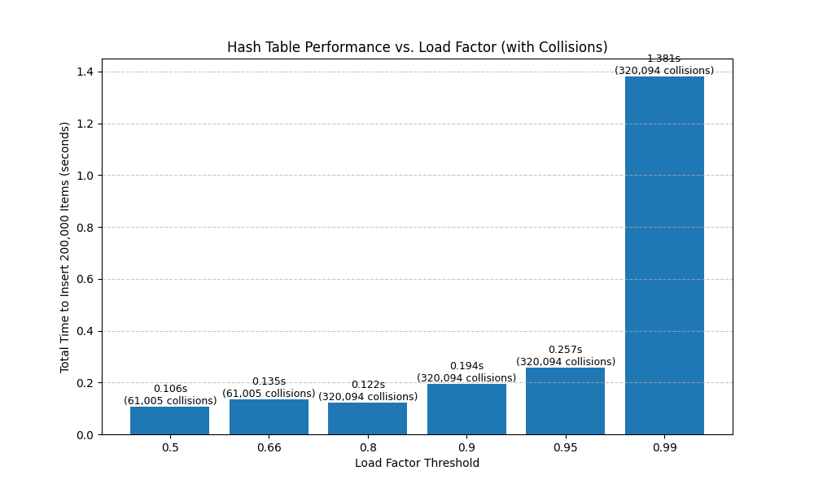
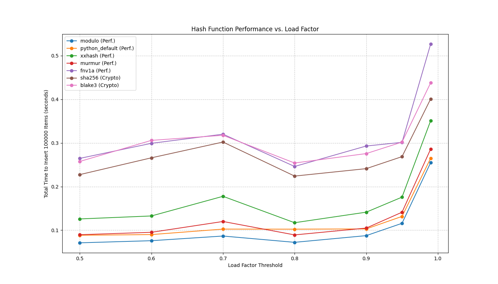

# Exploring Hash Table Performance in Python

This project contains a series of Python experiments designed to visually explore the performance characteristics of hash tables. By simulating a large number of insertions, we analyze the real-world impact of three key factors: **load factor**, **hash collisions**, and the choice of **hash function**.

## Experiment 1: Load Factor vs. Resize Cost

**Goal:** To measure how the load factor threshold affects the number of resize operations and the overall insertion time in a collision-free environment.

**Methodology:** 200,000 sequential integers were inserted into a simulated hash table. The hash function used was a simple modulo operation on the item's index, which guarantees no collisions for this input. This isolates the cost of resizing.

**Results:**


**Findings:** The chart shows that a lower load factor (e.g., 0.5) results in more frequent resizing (16 resizes). A higher load factor (e.g., 0.99) reduces the number of resizes (15 resizes), leading to a slight decrease in total time in this ideal, collision-free simulation.

---

## Experiment 2: The Impact of Collisions

**Goal:** To demonstrate how performance degrades as the load factor increases when hash collisions are introduced.

**Methodology:** 200,000 random integers were inserted into the hash table, using Python's default `hash()` function. Collisions were handled using linear probing.

**Results:**


**Findings:** The chart clearly shows that while the time cost is low and stable for load factors below 0.8, it increases exponentially as the table becomes nearly full. At a load factor of 0.99, the time spent resolving over 320,000 collisions dramatically slows down the process. This proves that keeping a hash table sufficiently sparse is critical for maintaining its O(1) average-case performance.

---

## Experiment 3: Comparing Different Hash Functions

**Goal:** To compare the real-world performance of several popular performance-oriented and cryptographic hash functions across various load factors.

**Methodology:** 100,000 random integers were inserted into the hash table for each combination of hash function and load factor.

**Results:**


**Findings:**
* **Performance vs. Security**: The cryptographic hashes (`sha256`, `blake3`) are significantly slower than all performance-oriented hashes. This is due to the immense computational overhead required to provide security guarantees, making them unsuitable for performance-critical data structures.
Yes, that's an excellent idea. Separating them is much clearer and more accurate to the results on your chart.

* **Fastest Hashes in This Test**: For this specific experiment with ideal random data, `modulo`, `python_default`, `murmur`, and `fnv1a` were clustered together as the top performers. However, the speed of `modulo` can be misleading, as it performs poorly with non-random, patterned data.

* **The `xxhash` Outlier**: An interesting result was `xxhash`. While it is known to be one of the fastest hashes in the industry, it appeared to have slightly more overhead in this specific test. This is likely due to the Python library wrapper and the very small size (8 bytes) of the data being hashed.

> This experiment highlights a key principle: the "best" hash function depends on the specific trade-offs between speed, security, and the nature of the data. The detailed analysis below provides a full explanation of these trade-offs.


## Overall Conclusions

1.  The **load factor** is the most critical parameter for tuning the time-space trade-off in a hash table.
2.  High load factors (> 0.8) lead to a dramatic increase in **collisions**, which is the primary cause of performance degradation.
3.  The choice of **hash function** is crucial. Non-cryptographic hashes are designed for speed and good key distribution, making them ideal for hash tables. Cryptographic hashes are designed for security and are too slow for this use case.

Of course. Here is a more polished and complete version of the "How to Run" section, formatted to be very clear for any new user.

-----

## Setup and Running the Experiments

Follow these steps to set up your environment and run the simulations.

### 1\. Prerequisites

  * Python 3.8+
  * `uv` (or `pip` and `venv`)

### 2\. Install Dependencies

This project uses a `pyproject.toml` file to manage dependencies.

**Option A: Using `uv` (Recommended)**
`uv` will automatically find the `pyproject.toml` and sync the environment.

```bash
uv sync
```

**Option B: Using `pip`**
You can also install the dependencies using `pip`.

```bash
pip install .
```

### 3\. Run an Experiment

Run any of the experiment scripts. A `.png` image of the resulting chart will be saved in the project directory.

```bash
# To run the comprehensive hash function comparison
python hash_function_comparing_different_hash_function.py
```